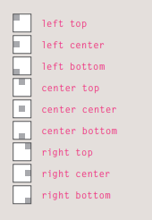
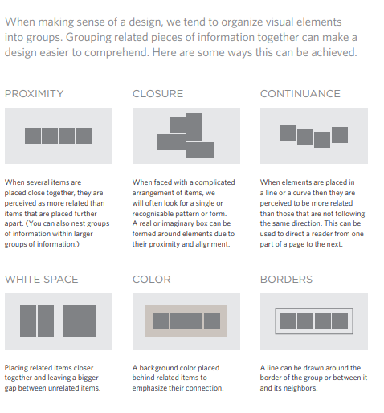

# ch16 : images 
in this chapter we will learn how to
* control size of an image in CSS

(We can do this by control height + width )
**sizes that are commonly used on all pages, such as:**
1. Small portrait: 220 x 360
2. Small landscape: 330 x 210
3. Feature photo: 620 x 400


* aligning images in CSS 
Rather than using the ````
element's align attribute, web
page authors are increasingly
using the float property to align
images. 

Once it has been made into a
block-level element, there are
two common ways in which you
can horizontally center an image:
1. On the containing element,
you can use the text-align
property with a value of center.
2. On the image itself, you can
use the use the margin property
and set the values of the left and
right margins to auto.

***Centering imagesUsing CSS***
 to center an image, it
should be turned into a blocklevel element using the display


property with a value of block
* **add background image** 
The background-image
property allows you to place
an image behind any HTML
element. This could be the entire
page or just part of the page. By
default, a background image will
repeat to fill the entire box.


### Repeating Images & background-repeat 
* repeat-x The image is repeated horizontally
* repeat-y The image is repeated vertically
only.
* no-repeat The image is only shown once.

### background-attachment:The background-attachment
property specifies whether a
background image should stay in
one position or move as the user
scrolls up and down the page. It
can have one of two values:
1. fixed :The background image stays in the same position on the page
2. scroll The background image moves up and down as the user crolls
up and down the page.

### background-position 
background-position: center top;



The properties must be specified
in the following order, but you
can miss any value if you do not
want to specify it.
1. background-color
2. background-image
3. background-repeat
4. background-attachment
5. background-position

* create image rollover in CSS 
Using CSS, it is possible to create
a link or button that changes to a
second style when a user moves
their mouse over it (known as a
rollover) and a third style when
they click on it.

### layouts and wireframe 


### Summary
PROCESS & Design
* It's important to understand who your target audience
is, why they would come to your site, what information
they want to find and when they are likely to return.
* Site maps allow you to plan the structure of a site.
* Wireframes allow you to organize the information that
will need to go on each page.
* Design is about communication. Visual hierarchy helps
visitors understand what you are trying to tell them.
* You can differentiate between pieces of information
using size, color, and style.
* You can use grouping and similarity to help simplify
the information you present.


Summary
PRACTICAL INFORMATION
* Search engine optimization helps visitors find your
sites when using search engines.
* Analytics tools such as Google Analytics allow you to
see how many people visit your site, how they find it,
and what they do when they get there.
* To put your site on the web, you will need to obtain a
domain name and web hosting.
* FTP programs allow you to transfer files from your
local computer to your web server.
* Many companies provide platforms for blogging, email
newsletters, e-commerce and other popular website
tools (to save you writing them from scratch).