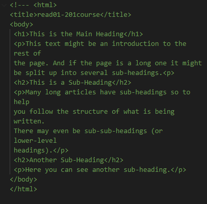
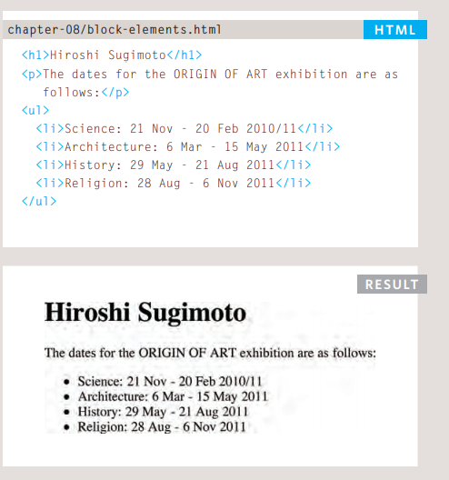
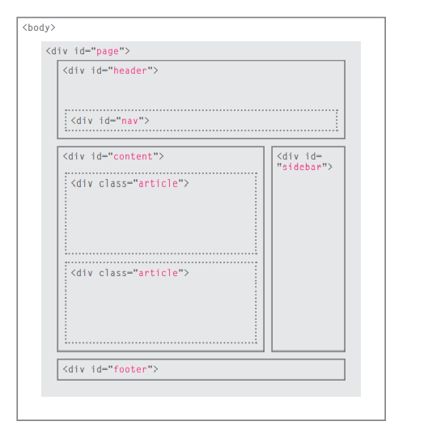
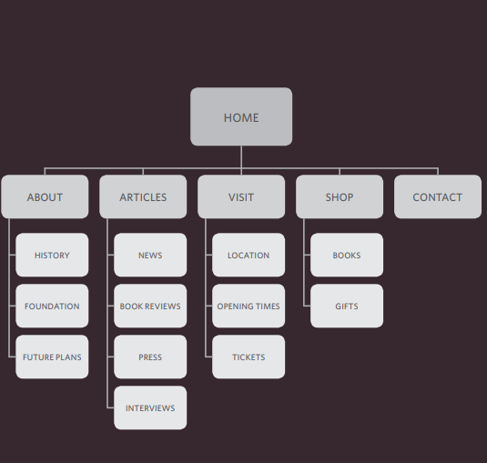

# chapter 1 HTML structure 

what is HTML ? 
its a structure and content of the website 

## standard  HTML page 

**body**
You met the *body* element
in the first example we created.
Everything inside this element is
shown inside the main browser
window.

**head**
Before the **body** element you
will often see a
**head** element.
This contains information
about the page (rather than
information that is shown within
the main part of the browser
window that is highlighted in
blue on the opposite page).
You will usually find a **title**
element inside the 
**head**
element.

### HTML pages are text documents.

* HTML uses tags (characters that sit inside angledbrackets) to give the information they surround special
meaning.
* Tags are often referred to as elements.
* Tags usually come in pairs. The opening tag denotes
the start of a piece of content; the closing tag denotes
the end.
* Opening tags can carry attributes, which tell us more
about the content of that element.
* Attributes require a name and a value.
* To learn HTML you need to know what tags are
available for you to use, what they do, and where they
can go.

# chapter 8

Whenever you want to collect information from
visitors you will need a form, which lives inside a
*form* element.
* Information from a form is sent in name/value pairs.
* Each form control is given a name, and the text the
user types in or the values of the options they select
are sent to the server.
* HTML5 introduces new form elements which make it
easier for visitors to fill in forms.

***Because there have been
several versions of HTML, each
web page should begin with a
DOCTYPE declaration to tell a
browser which version of HTML
the page is using (although
browsers usually display the
page even if it is not included).
We will therefore be including
one in each example for the rest
of the book***

comments in HTML be like this 

## lists in HTML be like this

## CSS 

* You can specify the dimensions of images using CSS.
* This is very helpful when you use the same sized
images on several pages of your site.
* Images can be aligned both horizontally and vertically
using CSS.
* You can use a background image behind the box
created by any element on a page.
* Background images can appear just once or be
repeated across the background of the box.
* You can create image rollover effects by moving the
background position of an image.
* To reduce the number of images your browser has to
load, you can create image sprites.

### HTML layout 

+ The new HTML5 elements indicate the purpose of
different parts of a web page and help to describe
its structure.
+  The new elements provide clearer code (compared
with using multiple **div** elements).
+ Older browsers that do not understand HTML5
elements need to be told which elements are
block-level elements.
+ To make HTML5 elements work in Internet Explorer 8
(and older versions of IE), extra JavaScript is needed,
which is available free from Google.

#### do the sit map first 

