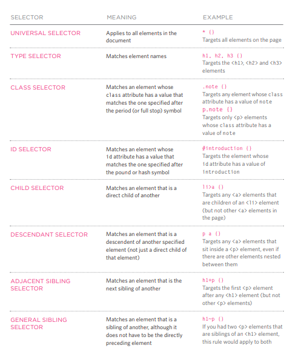
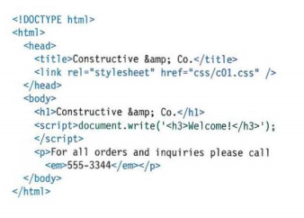
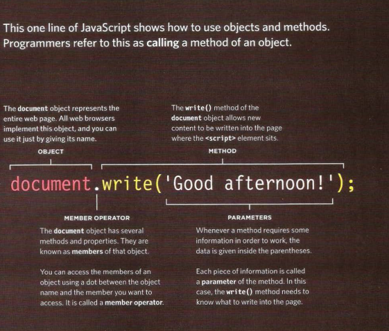
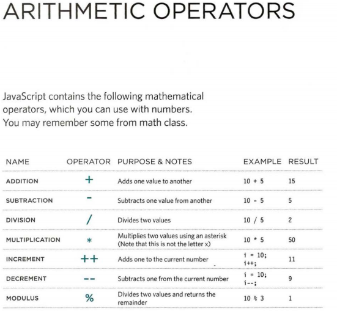

## HTML aGAIN ! 
 * HTML pages are text documents.
* HTML uses tags (characters that sit inside angled
brackets) to give the information they surround special
meaning.
* Tags are often referred to as elements.
* Tags usually come in pairs. The opening tag denotes
the start of a piece of content; the closing tag denotes
the end.
* Opening tags can carry attributes, which tell us more
about the content of that element.
* Attributes require a name and a value.
* To learn HTML you need to know what tags are
available for you to use, what they do, and where they
can go.

## HEADINGS
# this is header one size
## this is header two size
### this is header three size
#### this is header four size
##### this is header five size
###### this is header six size


#### useful tags of you HTML 

* ``<p>`` paragragh tag: make a paragrpgh 
* ``<b>`` bold tag   :make atext bols
* ``<i>`` italic tag: make a text italic
* ``<br />``break line
* ``<sub>``you can do sub/sup also in HTML 
+ ``<hr />``To create a break line drawn 
+ ``<em>`` element indicates
emphasis that subtly changes
the meaning of a sentence
+ ``<q>`` this  tag for short quotes
+ ``<audio src="audio/test-audio.ogg"
 controls autoplay>`` and audio can be inserted in HTML i this way .


## CSS introduction 


Summary
FLASH, VIDEO & AUDIO
* Flash allows you to add animations, video and audio to
the web.
* Flash is not supported on iPhone or iPad.
* HTML5 introduces new ``<video>`` and ``<audio>``
elements for adding video and audio to web pages, but
these are only supported in the latest browsers.
* Browsers that support the HTML5 elements do not
all support the same video and audio formats, so you
need to supply your files in different formats to ensure
that everyone can see/hear them.

to link CSS file into html page

``` <link href="css/styles.css" type="text/css" rel="stylesheet" /> ```


``<style>`` tag to make inline CSS in the same html code

## CSS SELECTORS



 ## javascript

 PLACING THE SCRIPT
IN THE PAGE
You may see JavaScript in the HTML between
opening ``<script> and closing </script>``` tags
(but it is better to put scripts in their own files). 





## calling method in java



* It is best to keep JavaScript code in its own JavaScript
file.
* JavaScript files are text files (like HTML pages and
CSS style sheets), but they have the . j s extension.
The HTML ``<script> element is used in HTML pages``
to tell the browser to load the JavaScript file (rather like
the ``<link>`` element can be used to load a CSS file).
If you view the source code of the page in the browser,
the JavaScript will not have changed the HTML,
because the script works with the model of the web
page that the browser has created.


## DATA TYPES in javascript
1. NUMERIC DATA TYPE '.25'
2. STRING DATA TYPE  'name'
3. BOOLEAN DATA TYPE  'true'


 

#### vaiables used to store values


Here are six rules you must always follow when giving a variable a name:

1. The name must begin with
a letter, dollar sign ($),or an
underscore (_). It must not start
with a number.
=-------------------------------------------------
2. The name can contain letters,
numbers, dollar sign ($), or an
underscore (_). Note that you
must not use a dash(-) or a
period (.) in a variable name.
---------------------------------------------------
3. You cannot use keywords or
reserved words. Keywords
are special words that tell the
interpreter to do something. For
example, var is a keyword used
to declare a variable. Reserved
words are ones that may be used
in a future version of JavaScript.
ONLINE EXTRA
View a full list of keywords and
reserved words in JavaScript.
------------------------------------------------
4. All variables are case sensitive,
so score and Score would be
different variable names, but
it is bad practice to create two
variables that have the same
name using different cases.

---------------------------------------------------
5. Use a name that describes the
kind of information that the
variable stores. For example,
fi rstName might be used to
store a person's first name,
l astNarne for their last name,
and age for their age.

----------------------------------------------

6. If your variable name is made
up of more than one word, use a
capital letter for the first letter of
every word after the first word.
For example, f i rstName rather
than fi rstnarne (this is referred
to as camel case). You can also
use an underscore between each
word (you cannot use a dash)


***ARRAYS***

An array is a special type of variable. It doesn't
just store one value; it stores a list of values. 





Summary
TABLES
* The ``<table>`` element is used to add tables to a web
page.
* A table is drawn out row by row. Each row is created
with the ``<tr>`` element.
* Inside each row there are a number of cells
represented by the ``<td>`` element (or ``<th>`` if it is a
header).
* You can make cells of a table span more than one row
or column using the rowspan and colspan attributes.
* For long tables you can split the table into a ```<thead> <tbody>, and <tfoot>``


