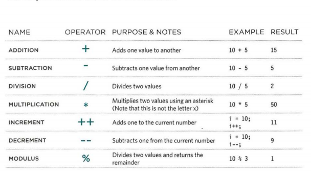

## HTML aGAIN ! 
 * HTML pages are text documents.
* HTML uses tags (characters that sit inside angled
brackets) to give the information they surround special
meaning.
* Tags are often referred to as elements.
* Tags usually come in pairs. The opening tag denotes
the start of a piece of content; the closing tag denotes
the end.
* Opening tags can carry attributes, which tell us more
about the content of that element.
* Attributes require a name and a value.
* To learn HTML you need to know what tags are
available for you to use, what they do, and where they
can go.

## HEADINGS
# this is header one size
## this is header two size
### this is header three size
#### this is header four size
##### this is header five size
###### this is header six size

### HTML tags 
``<p>`` paragraph consists of one or more sentences
 that form a self-contained unit of discourse. The
 start of a paragraph is indicated by a new
 line.```

 * also you can make text bold or italic
 ``<b>``
 ``<i>``

* you can do sub/sup also in HTML 

 ``<br />``break tag to break line like this 
 
 ``<strong>`` The use of the 
element indicates that its
content has strong importance

``<q>`` this tag to indicates that this is a quote

* you can insert audio to a web page using  these command 
``<audio src="audio/test-audio.ogg"
 controls autoplay> ``


 ### ***Summary FLASH, VIDEO & AUDIO***
+ Flash allows you to add animations, video and audio to
the web.
+ Flash is not supported on iPhone or iPad.
+ HTML5 introduces new <video> and <audio>
elements for adding video and audio to web pages, but
these are only supported in the latest browsers.
+ Browsers that support the HTML5 elements do not
all support the same video and audio formats, so you
+ need to supply your files in different formats to ensure
that everyone can see/hear them


## introduction to CSS 

-------------------------------------------
+ CSS allow you to change the font type


+ CSS allow you to change the font color


*** you can line a CSS file to html using ``<link>`` tag  , if its an xternal file .


* SELECTORS are ver importenet in CSS , take a look 


## java script the boss of conrolling 

``<script>`` script tag used in HTML to script the java script file into it internelly or externally 
``<script src="j s/ add-content .j s "></script>``


* Document.write object in javascript and this is how you can use it .


*summary*
* It is best to keep JavaScript code in its own JavaScript
file.
* JavaScript files are text files (like HTML pages and
CSS style sheets), but they have the . j s extension.
* The HTML ``<script>`` element is used in HTML pages
to tell the browser to load the JavaScript file (rather like
the`` <link>`` element can be used to load a CSS file).
* If you view the source code of the page in the browser,
the JavaScript will not have changed the HTML,
because the script works with the model of the web
page that the browser has created.

### how to declare a variable in java script 
*then you can assign a value for it*


#### data types in javascript
* NUMERIC DATA TYPE
The numeric data type handles
numbers.
0.75 

* STRING DATA TYPE
The strings data type consists of
letters and other characters.
'H.
1 ' Ivy! 1 
* BOOLEAN DATA TYPE
Boolean data types can have one
of two values: true or false.
true


### You create an array and give it a name just like you would any other variable (using the var keyword followed by the name of the array)


* arithmetic operators in javascript


+ logical operatore


+ swicth is GREAT 
```
switch (level) {
case 'One ':
title= 'Level 1 ' ;
break;
case 'Two':
tit 1 e = ' Level 2 ' ;
break;
case ' Three' :
title = 'Level 3' ;
break ;
default :
title= 'Test';
break; }
```


