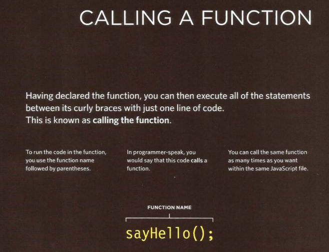

``<dl>``
``<dt>``
``<dd>``

The definition list is created with
the ``<dl>`` element and usually
consists of a series of terms and
their definitions.
Inside the ``<dl>`` element you will
usually see pairs of`` <dt>`` and
``<dd>`` elements.

### Nested Lists
You can put a second list inside
an ``<li>`` element to create a sublist or nested list.

* There are three types of HTML lists: ordered,
unordered, and definition.
* Ordered lists use numbers.
* Unordered lists use bullets.
* Definition lists are used to define terminology.
* Lists can be nested inside one another.

### Writing Links

Links are created using the`` <a>`` element. Users can click on anything
between the opening ``<a>`` tag and the closing ``</a>`` tag. You specify
which page you want to link to using the href attribute.

*** relativel links types**

## summary LISTS, TABLES AND FORMS CSS
* In addition to the CSS properties covered in other
chapters which work with the contents of all elements,
there are several others that are specifically used to
control the appearance of lists, tables, and forms.
* List markers can be given different appearances
using the list-style-type and list-style image
properties.
* Table cells can have different borders and spacing in
different browsers, but there are properties you can
use to control them and make them more consistent.
* Forms are easier to use if the form controls are
vertically aligned using CSS.
* Forms benefit from styles that make them feel more
interactive.

**Building Blocks** 
CSS treats each HTML element as if it is in its
own box. This box will either be a block-level
box or an inline box.
Block-level boxes start on a new line and act as the main building blocks
of any layout, while inline boxes flow between surrounding text. You can
control how much space each box takes up by setting the width of the
boxes (and sometimes the height, too). To separate boxes, you can use
borders, margins, padding, and background colors.

# Controlling the
Position of Elements

CSS has the following positioning schemes that allow you to control
the layout of a page: normal flow, relative positioning, and absolute
positioning. You specify the positioning scheme using the position
property in CSS. You can also float elements using the float property.
### Normal flow
Every block-level element
appears on a new line, causing
each item to appear lower down
the page than the previous one.
Even if you specify the width
of the boxes and there is space
for two elements to sit side-byside, they will not appear next
to each other. This is the default
behavior (unless you tell the
browser to do something else).
### Relative Positioning
This moves an element from the
position it would be in normal
flow, shifting it to the top, right,
bottom, or left of where it
would have been placed. This
does not affect the position of
surrounding elements; they stay
in the position they would be in
in normal flow.
### Absolute positioning
This positions the element
in relation to its containing
element. It is taken out of
normal flow, meaning that it
does not affect the position
of any surrounding elements
(as they simply ignore the
space it would have taken up).
Absolutely positioned elements
move as users scroll up and
down the page.

To indicate where a box should be positioned, you may also need to use
box offset properties to tell the browser how far from the top or bottom
and left or right it should be placed. (You will meet these when we
introduce the positioning schemes on the following pages.)
* Fixed Positioning
This is a form of absolute
positioning that positions
the element in relation to the
browser window, as opposed
to the containing element.
Elements with fixed positioning
do not affect the position of
surrounding elements and they
do not move when the user
scrolls up or down the page.

* Floating Elements
Floating an element allows
you to take that element out
of normal flow and position
it to the far left or right of a
containing box. The floated
element becomes a block-level
element around which other
content can flow.

screen 
* Screen Sizes
* Screen Resolution
* Page Sizes
* Fixed Width Layouts

## basic javascript instructions

* A script is made up of a series of statements. Each
statement is like a step in a recipe.
* Scripts contain very precise instructions. For example,
you might specify that a value must be remembered
before creating a calculation using that value.
* Variables are used to temporarily store pieces of
information used in the script.
* Arrays are special types of variables that store more
than one piece of related information.
* JavaScript distinguishes between numbers (0-9),
strings (text), and Boolean values (true or false).
* Expressions evaluate into a single value.
* Expressions rely on operators to calculate a value

## js functions

**How does pair programming work?**
While there are many different styles, pair programming commonly involves two roles: the Driver and the Navigator. The Driver is the programmer who is typing and the only one whose hands are on the keyboard. Handling the “mechanics” of coding, the Driver manages the text editor, switching files, version control, and—of course writing—code. The Navigator uses their words to guide the Driver but does not provide any direct input to the computer. The Navigator thinks about the big picture, what comes next, how an algorithm might be converted in to code, while scanning for typos or bugs. The Navigator might also utilize their computer as a second screen to look up solutions and documentation, but should not be writing any code.

* Why pair program?

1. Greater efficiency
1. Engaged collaboration
1. Learning from fellow students
1. Social skills
1. Job interview readiness

