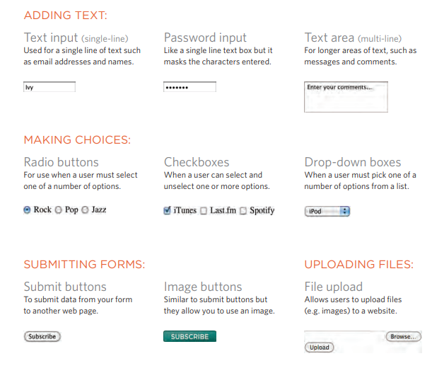

Old Code:
Width & Spacing

There are some outdated
attributes which you should not
use on new websites. You may,
however, come across some
of them when looking at older
code, so I will mention them
here. All of these attributes have
been replaced by the use of CSS.
The width attribute was used
on the opening ``<table>`` tag to
indicate how wide that table
should be and on some opening
``<th>`` and ``<td>`` tags to specify
the width of individual cells.
The value of this attribute is
the width of the table or cell in
pixels.
The columns in a table need to
form a straight line, so you often
only see the width attribute on
the first row (and all subsequent
rows would use that setting).
The opening ``<table>`` tag could
also use the cellpadding
attribute to add space inside
each cell of the table, and the
cellspacing attribute to create
space between each cell of
the table. The values for these
attributes were given in pixels.
I added CSS styles to this
example so that you can see the
width of the table cells more
clearly. If you want to control
the width or spacing of tables
and cells you should use CSS as
shown on pages 303, 337-340.

Old Code:
Border & Background

The border attribute was used
on both the <table> and <td>
elements to indicate the width of
the border in pixels.
The bgcolor attribute was used
to indicate background colors
of either the entire table or
individual table cells. The value
is usually a hex code (which we
discuss on pages 249-252).
This example uses the HTML
border and bgcolor attributes.
No CSS attributes were utilized
in this example.
When building a new website
you should use CSS to control
the appearance of the table
rather than these attributes.
They are only covered here
because you may come across
them if you look at the code of
older websites.

* The ``<table>`` element is used to add tables to a web
page.
* A table is drawn out row by row. Each row is created
with the ``<tr>`` element.
* Inside each row there are a number of cells
represented by the ``<td>`` element (or ``<th>`` if it is a
header).
* You can make cells of a table span more than one row
or column using the rowspan and colspan attributes.
X For long tables you can split the table into a ``<thead>``,
``<tbody>``, and ``<tfoot>``.

## Why Forms?
The best known form on the web is probably
the search box that sits right in the middle of
Google's homepage

Form Controls
There are several types of form controls that
you can use to collect information from visitors
to your site

### SummaryBOXES CSS
* CSS treats each HTML element as if it has its own box.
* You can use CSS to control the dimensions of a box.
* You can also control the borders, margin and padding
for each box with CSS.
* It is possible to hide elements using the display and
visibility properties.
* Block-level boxes can be made into inline boxes, and
inline boxes made into block-level boxes.
* Legibility can be improved by controlling the width of
boxes containing text and the leading.
* CSS3 has introduced the ability to create image

### ch14 Lists, Tables and Forms

Example
LISTS, TABLES AND FORMS
LISTS, TABLES AND FORMS 350
For the list of free poetry events near the start of the page, the bullet
points are styled with an image. The space between each list item is
increased using the line-height property.
For the table, the gaps between cells are removed using the borderspacing property. Font size is set for the ``<td>`` and ``<th>`` elements as
they do not inherit their size from parent elements.
The head of the table has a darker background, light text, and a dark
2-pixel line between it and the table content. Rounded corners on the
table header are created using the :first-child and :last-child
pseudo classes (for browsers that support rounded corners).
Alternate rows of the table have different shading, and texture is added
with different borders on each side of the cell.
For the form, the related form controls are put in a ``<fieldset>`` element.
The labels of the form controls on the left also use the float property to
ensure the form controls are vertically aligned.
When the text boxes of the form receive focus, or the user hovers over it,
the background color and border colors change. The submit button has
also been styled to make it clear where people should submit the form.
This example demonstrates several of the
CSS properties we have met in this chapter to
control the presentation of lists, tables, and
forms.

Summary
LISTS, TABLES AND FORMS
* In addition to the CSS properties covered in other
chapters which work with the contents of all elements,
there are several others that are specifically used to
control the appearance of lists, tables, and forms.
* List markers can be given different appearances
using the list-style-type and list-style image
properties.
* Table cells can have different borders and spacing in
different browsers, but there are properties you can
use to control them and make them more consistent.
* Forms are easier to use if the form controls are
vertically aligned using CSS.
* Forms benefit from styles that make them feel more 